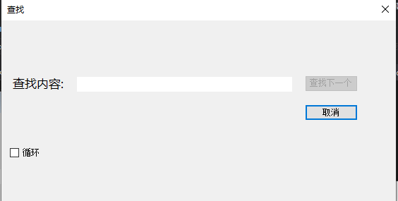
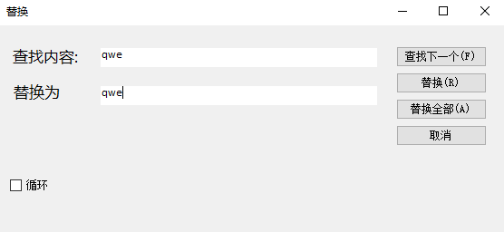
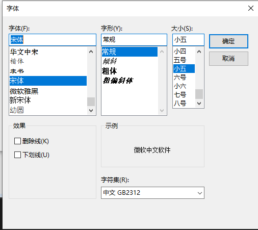

#使用方法

鼠标点击或键盘快捷键，支持鼠标右键打开菜单  

## 查找替换功能 ##
查找功能，在文本框里输入文字，点击下一个会自动查找，不选择循环的话，到文件结尾就不会再查找了  

  
  
替换功能，在文本框里输入查找内容和替换内容，点击下一个会自动查找。再点击替换/替换全部会自动替换对应的查找内容，不选择循环的话，到文件结尾就不会再查找了

选择 格式=>字体后出现以下选择框，选择自己所需要的字体
